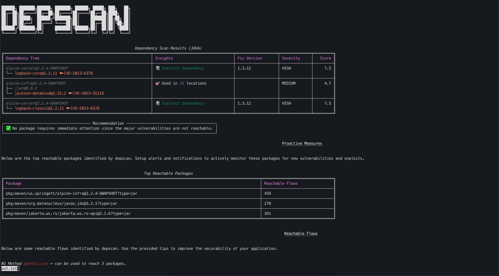
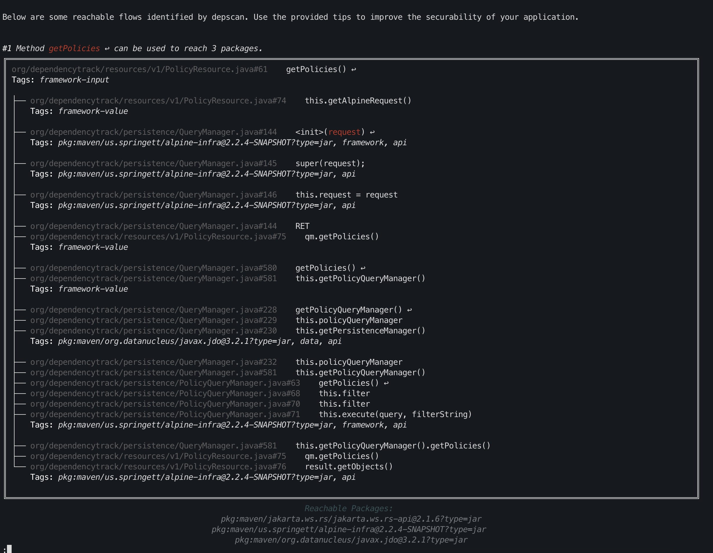
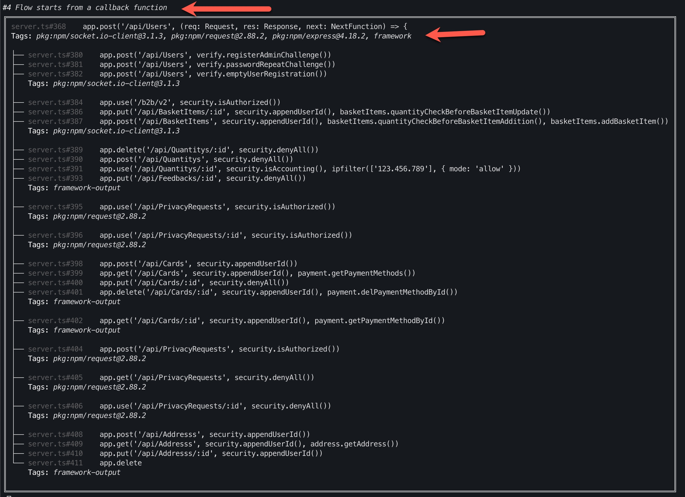
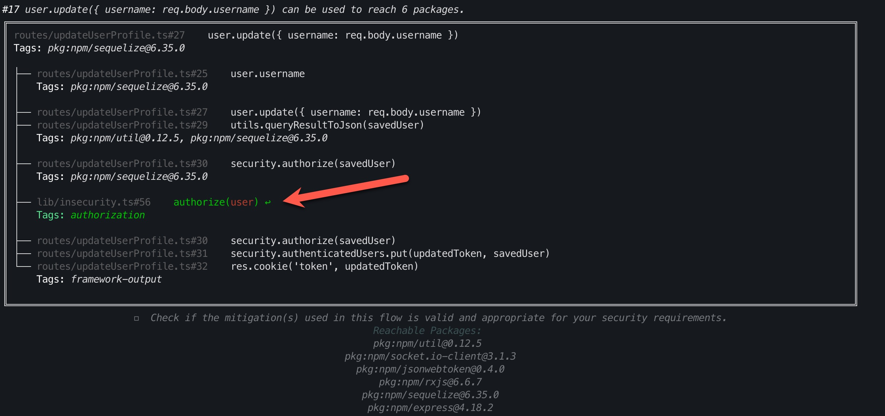
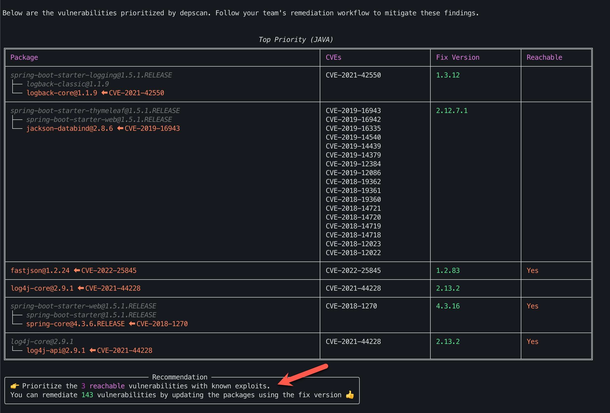

---

date: 2023-12-04 00:00:00-0700
categories: blog
author: Prabhu Subramanian
author_image: /assets/images/people/prabhu-s.jpg
layout: blogpost
title: OWASP dep-scan v5 released
excerpt_separator: <!--more-->

---

Application Security is a domain where anyone, no matter who they are, what degree they hold and where they live, can shine and make a true positive impact worldwide. To learn application security and even author security tools you only need passion.

Today, we announce the release of [OWASP dep-scan](https://github.com/owasp-dep-scan/dep-scan) version 5, a next-generation SCA tool, that would redefine the entire Software Composition Analysis (SCA) tools category as we know it. The release is packed with several key innovations to improve the precision of results (in a category that suffers from false positives) and make them actionable.

<!--more-->

## Precision Reachability-analysis for everyone

OWASP dep-scan v5 (MIT) is the first open-source SCA tool to bring precision reachability analysis for everyone. Powered by the latest [CycloneDX Generator](https://github.com/CycloneDX/cdxgen) and [atom](https://github.com/AppThreat/atom), depscan is the only SCA tool that supports several variants of reachability analysis to cater to a range of applications.

- Forward-Reachability analysis from source to sink (Most applications)
- Reverse-Reachability analysis from sink to virtual sources (Libraries and Modules)
- Inter-procedural and inter-package analysis (Identify all packages that can be reached from the same flow)





## Privacy first and CI/CD friendly

dep-scan is the only SCA tool that can perform all the analysis including reachability analysis entirely in your [CI/CD](https://github.com/owasp-dep-scan/dep-scan/blob/master/.github/workflows/dockertests.yml#L98) environment with no code or SBOM ever leaving your premise.

5
With no telemetry and tracking, the tool is ideal for integration and execution in air-gapped environments.

## OASIS CSAF VEX support

dep-scan can also operate as a VEX machine to help your team prove why the given vulnerabilities are NOT EXPLOITABLE using reachability as a justification. The results can be exported as [CSAF VEX](https://github.com/owasp-dep-scan/dep-scan/blob/master/contrib/CSAF_README.md) documents.

## More cutting-edge features

dep-scan container image is available in nydus format for on-demand pulling. The vulnerability database is available as a single Registry-Accelerated File System (RAFS) image for effortless peer-to-peer distribution and incremental updates.

## Learn more

The best way to learn about OWASP dep-scan is by visiting the GitHub repo and trying the tool for a few projects.

https://github.com/owasp-dep-scan/dep-scan

### Using container image

```
podman pull ghcr.io/owasp-dep-scan/depscan:v5.0.0
docker pull ghcr.io/owasp-dep-scan/depscan:v5.0.0
```

### Using python package with cdxgen

```
npm install -g @cyclonedx/cdxgen
pip install owasp-depscan
```

## More screenshots






