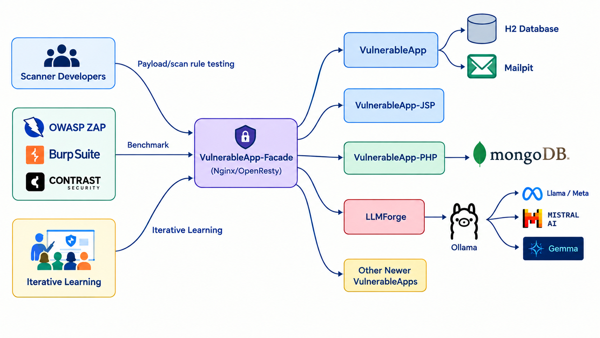

## OWASP VulnerableApp: Building a Benchmark for the Next Generation of Security Scanners

Security scanners are getting better, but how do we actually know how good they are?

___OWASP VulnerableApp brings known vulnerability scenarios into a reproducible environment for security-tool testing and benchmarking.___

The project provides intentionally vulnerable applications that enable security researchers, scanner developers, and security professionals to evaluate detection capabilities against defined vulnerability conditions. By combining reproducible scenarios with benchmarking, VulnerableApp aims to make security-tool evaluation more structured, measurable, and comparable.

### Why benchmarking needs a different approach

Projects such as OWASP Juice Shop, WebGoat, and DVWA provide valuable environments for security education and hands-on learning.

Benchmarking introduces another requirement. The same vulnerability can appear through different technologies, frameworks, coding patterns, and application flows. A scanner that detects one implementation may not detect another.

VulnerableApp is designed around known vulnerability scenarios that can serve as reference conditions for testing security tools.

### From scanner development to VulnerableApp

The idea began in 2019 while developing add-ons for ZAP by Checkmarx (formerly known as OWASP ZAP or Zed Attack Proxy). While working on a JWT vulnerability detection rule, testing required finding a suitable vulnerable application or building one specifically for that purpose.

That experience led to VulnerableApp: A deliberately vulnerable application designed with **security testing and extensibility as core considerations**.

## By the numbers

The project has grown across as the ecosystem of Vulnerable Applications. As of September 2026, project metrics record **100K+ Docker pulls for VulnerableApp and 50K+ for VulnerableApp-Facade**, alongside hundreds of GitHub stars and forks. The repository maintains dedicated metrics for Docker usage and GitHub traffic. Due to ease of extensibility, the project has reached **130 contributors** as well.

### The VulnerableApp architecture

Vulnerability behavior can depend on the underlying technology. The VulnerableApp has built a Facade architecture that provides a common layer between users and security tools and technology-specific vulnerable applications.

The facade provides common capabilities such as request routing, generic consistent scalable react based UI and a common metadata and benchmarking apis. Behind it, vulnerable scenarios can be implemented using technologies such as Java/Spring Boot, JSP/Servlet, PHP, and other technology stacks.

The purpose is to provide a consistent interaction model while allowing vulnerability behavior to remain technology-specific.

### From scanning to benchmarking

A scanner report shows what a tool detected. Benchmarking compares those findings against what is known to exist in the test environment.

VulnerableApp's benchmark framework supports both DAST and SAST workflows and compares submitted findings against known vulnerability data. The framework reports measures such as expected findings, detected findings, missed findings, unmatched findings, and coverage.

The workflow is straightforward:
* Run a security tool against VulnerableApp.
* Collect and normalize the findings.
* Compare them against known ground truth.
* Analyze detection coverage and gaps.
* This provides a practical foundation for more reproducible security-tool evaluation.

### What comes next

VulnerableApp is evolving in three areas:

**Benchmarking** — expanding comparison of security-tool results against known vulnerability scenarios.

**Learning** — exploring challenge-based experiences that help users understand vulnerability impact. As Vulnerabilities keep growing,it provides a great iterative way for learning various insecure and secure patterns for engineers and students.

**AI security** — extending the ecosystem through LLMForge to explore LLM-specific security scenarios.

### Building with the community

VulnerableApp is a community project. Developers, security researchers, educators, security professionals, and scanner developers can contribute vulnerability scenarios, technology-specific implementations, benchmarking improvements, documentation, and learning experiences.

Build reproducible security-testing environments that help the community understand how well security tools perform against known conditions.

### Get involved

GitHub — OWASP VulnerableApp: https://github.com/SasanLabs/VulnerableApp

GitHub Organisation: https://github.com/SasanLabs

The project is open to contributions and collaboration from the application security community.
